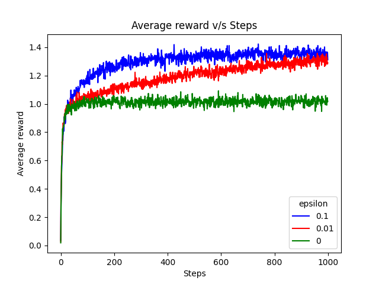
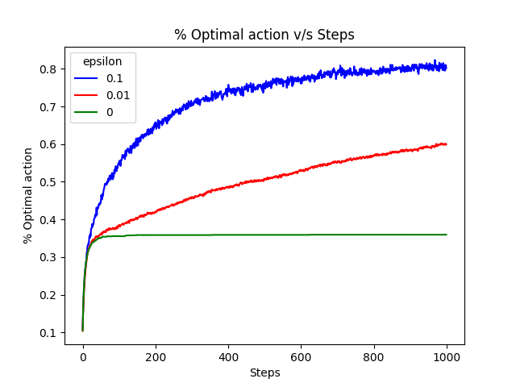

# Multi-Armed-Bandits
This repository contains minimalistic implementations of simple reinforcement learning algorithms for solving multi-armed bandits

*Note: All implementations use 10 arms*

## Action Selection: Epsilon-Greedy, Action Value Estimation: Sample Averaging

Incremental implementation of sample averaging method with epsilon-greedy action selection strategy from *Richard S. Sutton and Andrew G. Barto - Reinforcement Learning (2nd edition)*

### Training configuration

1. Number of runs = *2000*
2. Number of time steps in each run = *1000*
3. Epsilon covered = *[0, 0.1, 0.01]*

### Average reward v/s Steps

### % Optimal action v/s Steps
