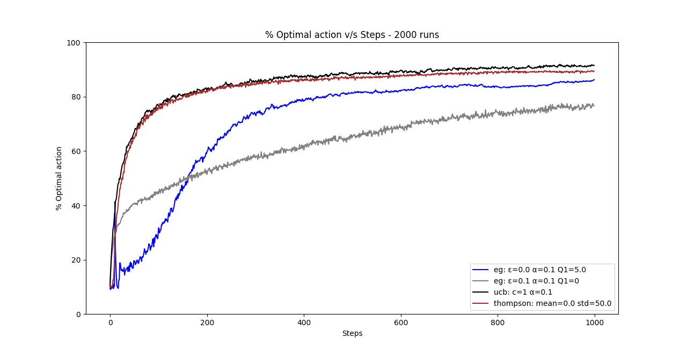

# Multi-Armed-Bandits
This repository contains minimalistic implementations of simple reinforcement learning algorithms for solving multi-armed bandits

*Note: All implementations use 10 arms*

### To do
1. Implement decaying epsilon for epsilon-greedy model
2. Figure out a way to store, calculate and display metrics

### Training configuration

1. Number of runs = *2000*
2. Number of time steps in each run = *1000*

## Epsilon-Greedy Model

Incremental implementation of sample averaging and constant step size method with epsilon-greedy action selection strategy from *Richard S. Sutton and Andrew G. Barto - Reinforcement Learning (2nd edition)*

## Upper Confidence Bound Model

Implementation of upper confidence bound action selection strategy and constant step size from *Richard S. Sutton and Andrew G. Barto - Reinforcement Learning (2nd edition)*

## Optimistic Initial Values

Incremental implementation of sample averaging and constant step size method with epsilon-greedy action selection and optimistic initial value estimates from *Richard S. Sutton and Andrew G. Barto - Reinforcement Learning (2nd edition)*

## Thompson Sampling

Implementation of thompson sampling assuming gaussian distribution with variance 1 for the reward distributions. Posterior distributions are thus, alos gaussian distributions.

*Note: I haven't varied the mean a lot because having a large standard deviation will automatically make the prior distribution very flat and so shifting the mean won't have a drastic effect*

## Comparisons

